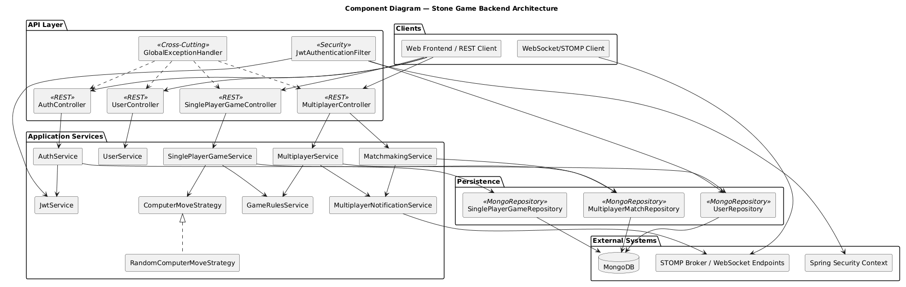
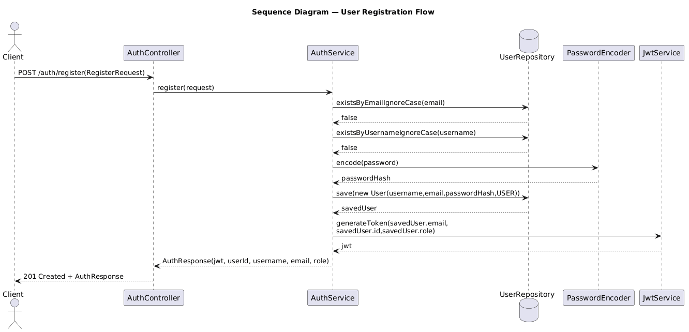
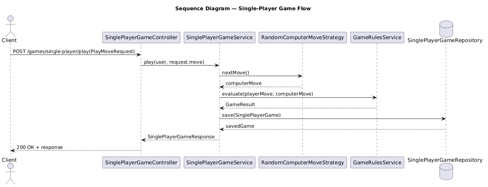
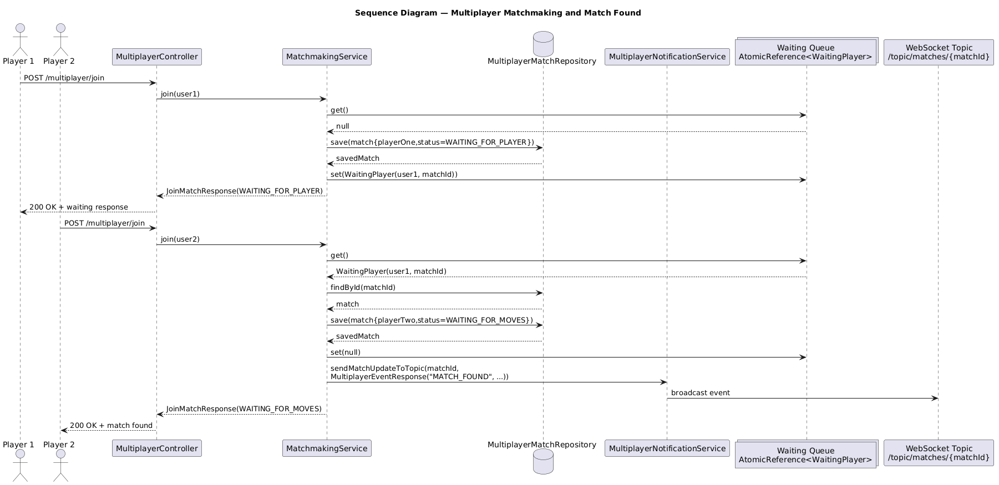
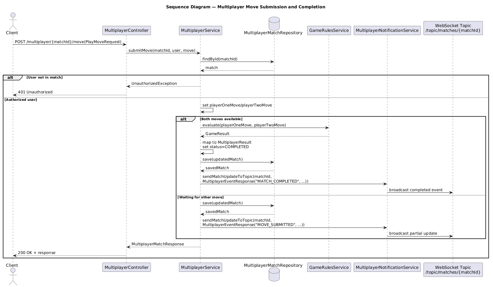

# Engineering Paper
# Stone Game Project

A full-stack application implementing a stone game, built with a modern microservices-oriented architecture and enhanced with observability and CI/CD practices.

---

## Overview

This project demonstrates:
- A **full-stack application** (frontend + backend)
- A **containerized architecture** using Docker
- A **monitoring and observability stack**
- A **CI/CD pipeline** using GitHub Actions
- A **Kubernetes-ready deployment approach**

## Architecture

The system is composed of multiple services:

- **Frontend** → Angular application
- **Backend** → Java (Spring Boot) REST API
- **Database** → MongoDB
- **Logging stack** → Fluent Bit + Elasticsearch + Kibana
- **Monitoring stack** → Prometheus + Grafana


## Backend Architecture

The backend is a **Spring Boot application** exposing REST APIs.

### Key responsibilities:
- Game logic (single-player / multiplayer)
- Authentication using JWT
- Persistence using MongoDB

### Components:

- **Controllers**
    - Handle HTTP requests
    - Expose REST endpoints (`/api/...`)

- **Services**
    - Contain business logic
    - Game rules, authentication, etc.

- **Repositories**
    - Interact with MongoDB
    - Use Spring Data

- **Security**
    - JWT-based authentication
    - Stateless API

### Configuration:
- `DB_URI` → Mongo connection
- `JWT_SECRET` → token signing
- `JWT_EXPIRATION` → token validity


### Components Diagram :


#### User Registration Flow Diagram :


#### Single Player Flow Diagram :


#### Multi-Player Match Making Flow Diagram :


#### Multi-Player Move Submission Flow Diagram :


### Backend Design Patterns :
The backend uses a layered and feature-oriented architecture, applies the Strategy pattern for game logic, the Repository pattern for persistence, DTOs for API contracts, and centralized exception handling for clean REST design.

- **Layered Architecture** : The backend follows a clear separation of concerns: Controller → Service → Repository.
Controllers handle HTTP requests, services contain business logic, and repositories manage data access.

- **Feature-Oriented Packaging** : The codebase is organized by business domains (auth, user, game) instead of technical layers, improving readability, modularity, and scalability.

- **Strategy Pattern** : The computer move logic in single-player mode uses the ComputerMoveStrategy interface with a RandomComputerMoveStrategy implementation.
This allows easy extension (e.g., smarter AI) without modifying core business logic.

- **DTO Pattern** : API communication is handled through DTOs (LoginRequest, AuthResponse, etc.), decoupling internal models from external contracts.

- **Repository Pattern** : Spring Data repositories abstract data access and isolate persistence logic from the business layer.

- **Dependency Injection (IoC)** : Components are injected via constructor-based dependency injection, reducing coupling and improving testability.

- **Centralized Exception Handling** : A GlobalExceptionHandler ensures consistent error responses and avoids duplicating error handling across controllers.

- **Stateless Authentication (JWT)** : The application uses JWT-based authentication, enabling a stateless, scalable, and cloud-friendly architecture.

---

## Frontend Architecture

The frontend is an **Angular application**.

### Key features:
- UI for playing the game
- Interaction with backend API
- Component-based architecture

### Structure:

- **Components**
    - Game UI
    - Player interactions

- **Services**
    - API calls to backend
    - State management

- **Routing**
    - Navigation between views

### Communication:
- Backend is accessed via: /api

### Frontend Design Patterns :

- **Component-Based Architecture** :
The application is built using reusable Angular components, each responsible for a specific part of the UI (game view, user interactions, etc.).

- **Feature-Oriented Structure** :
The frontend is organized by functional features (game, auth, shared), improving maintainability and scalability.

- **Service Layer Pattern** :
Angular services handle API communication and business logic, keeping components focused on presentation.

- **Shared Module / Reusable Components** :
Common UI elements and utilities are placed in a shared layer, promoting reuse and avoiding duplication.

- **Separation of Concerns (Smart vs Dumb Components)** :
Components are designed to separate:

- **Container components (logic, API calls)** :
Presentational components (UI rendering)

- **Reactive Programming (RxJS)** :
Asynchronous operations (HTTP calls, events) are handled using Observables, enabling reactive and scalable data flows.

- **Routing Pattern** :
Angular routing is used to manage navigation between views, providing a structured SPA experience.

- **Environment-Based Configuration** :
API endpoints and configurations are externalized using Angular environments for flexibility across environments.

---

## Monitoring & Observability

The project includes a full observability stack.

### Configuration as Code

Configuration as Code

```
monitoring/
├── fluent-bit/
├── prometheus/
└── grafana/
    ├── provisioning/
    └── dashboards/
```

---

### Logging Pipeline (ELK)

Logs flow as follows: Containers → Fluent Bit → Elasticsearch → Kibana


#### Components:

- **Fluent Bit**
    - Collects logs from Docker containers
    - Parses and forwards logs to ElasticSearch

- **Elasticsearch**
    - Stores logs in the index stonegame-logs-*
    - Enables search and indexing

- **Kibana**
    - Visualization interface
    - Log exploration dashboards
    - Automatically configured with a data view : Stonegame Logs

---

### Metrics Monitoring

Backend → Prometheus → Grafana


#### Components:

- **Prometheus**
    - Scrapes metrics from backend
    - Stores time-series data

- **Grafana**
    - Visualizes metrics
    - Pre-configured dashboards: "Stonegame Overview"
    - Prometheus as a data source

#### Available Metrics:
The backend exposes standard Spring Boot + JVM metrics:
- http_server_requests_seconds_count → request volume
- http_server_requests_seconds_sum → latency
- jvm_memory_used_bytes → memory usage
- system_cpu_usage → CPU usage
- process_uptime_seconds → uptime
---

## Docker Setup & Automation

The application is fully containerized using Docker Compose, The observability stack is fully automated within.

### Services:
- MongoDB
- Backend
- Frontend
- Elasticsearch
- Kibana
- Fluent Bit
- Prometheus
- Grafana

### Run locally:

```bash
docker compose up --build
```

| Service    | URL                                            |ACCESS        |
|------------| ---------------------------------------------- |--------------|
| Frontend   | [http://localhost:4200](http://localhost:4200) |              |
| Backend    | [http://localhost:8080](http://localhost:8080) |              |
| Kibana     | [http://localhost:5601](http://localhost:5601) |              |
| Grafana    | [http://localhost:3000](http://localhost:3000) |admin/admin   |
| Prometheus | [http://localhost:9090](http://localhost:9090) |              |
| Elastic    | [http://localhost:9200](http://localhost:9200) |              |


### Design Decisions
- Separation of concerns
  - Logs and metrics handled independently
- Push vs Pull model
  - Logs → pushed via Fluent Bit
  - Metrics → pulled by Prometheus
- Stateless services
  - Easy to scale horizontally
- Infrastructure as Code
  - All monitoring components are reproducible

---

### CI/CD Pipeline

The project includes a GitHub Actions pipeline.

CI (Continuous Integration):
- Runs tests
- Builds frontend & backend
- Builds Docker images

CD (Continuous Deployment):
- Builds and pushes images to GHCR
- Deploys to Kubernetes (cluster assumed pre-existing)

---

### Kubernetes Deployment (Concept)

The application is designed to be deployed on Kubernetes.

Resources:
- Deployments (frontend, backend, mongo)
- Services (ClusterIP)
- ConfigMaps & Secrets
- Istio Gateway & VirtualService

Deployment flow:
- Build images
- Push to registry
- Apply manifests: ```kubectl apply -f k8s/```

---

### Configuration & Secrets
Sensitive data is managed via:
- Kubernetes Secrets
- GitHub Secrets (for CI/CD)

---

### ⚠️ Notes
Kubernetes cluster provisioning is not included (assumed existing)

---

## Future Improvements

The next step would be to evolve this demo into a production-ready platform by improving horizontal scalability, externalizing realtime state, introducing alerting, managing configuration and secrets per environment, packaging deployments with Helm, and adopting a structured CD and artifact management strategy.

### Scalability
Scale the application horizontally by increasing backend replicas behind Kubernetes Services and using HPA based on CPU, memory, or custom metrics. For multiplayer, socket traffic should be externalized from in-memory state and backed by Redis Pub/Sub or a message broker so multiple backend instances can share realtime events consistently.

### Realtime Communication Evolution
WebSocket is a solid choice for multiplayer, but a stronger production approach could be:
- Socket.IO for reconnection and fallback handling
- WebRTC Data Channels for low-latency peer-to-peer interactions
- NATS / Kafka + gateway for more scalable event-driven realtime architectures

### Cloud Integration
A natural next step would be deploying the platform on GKE, using managed Kubernetes instead of a self-managed cluster. This would simplify cluster operations, autoscaling, upgrades, and production readiness.

### Alerting
Add Prometheus alerting rules and integrate Alertmanager to notify on critical situations such as backend downtime, high error rate, high response time, low disk space, or abnormal memory usage.

### Configuration & Secrets Management
Separate configuration by environment (dev, staging, prod) using Spring profiles, Angular environments, ConfigMaps, and Secrets. For production, secret management could be externalized to HashiCorp Vault for centralized and secure secret rotation.

### Infrastructure Monitoring
Extend monitoring beyond the application itself:
- MongoDB metrics with MongoDB exporter
- Elasticsearch / Kibana metrics with Elastic exporters
- Node-level metrics with Node Exporter
- Kubernetes cluster metrics with kube-state-metrics
- This would provide full visibility across app, database, logging, and infrastructure layers.

### Helm Adoption
Replace raw Kubernetes YAML files with a Helm chart to make deployments more reusable, parameterized, and environment-specific. This would simplify versioning and reduce duplication across environments.


### CD Strategy
A stronger delivery strategy would be:
- Developers merge into develop → automatic deployment to staging
- Release branches or semantic version tags → promotion candidate
- Production deployment triggered by tag creation or approved manual promotion. This creates a clearer separation between continuous integration, staging validation, and controlled production releases.

### Artifact Management
Container images and deployment artifacts should be stored in a dedicated registry. Harbor is a strong option because it provides image registry features, vulnerability scanning, retention policies, and RBAC. GHCR is good for a simpler setup, while Harbor is stronger for enterprise-style governance.


### Resilience Improvements

The current backend is intentionally simple, but several resilience improvements could make it more production-ready.

#### Database failure handling
Core flows such as registration, login, single-player persistence, matchmaking, and multiplayer state updates depend on MongoDB. In a production setup, transient database failures should be handled more explicitly with retries where safe, combined with clear error logging and monitoring.

**Example in Stone Game**:
if MongoDB is temporarily unavailable when saving a multiplayer match, the backend should fail fast, log the incident clearly, and expose metrics/alerts instead of silently degrading.

#### Timeouts for external interactions
Any interaction with external systems should have explicit timeouts to avoid blocking request threads.

**Example in Stone Game**:
sending WebSocket notifications through MultiplayerNotificationService should be bounded and monitored so notification issues do not block the full multiplayer flow.

#### Retries for transient failures
Retries should only be applied to operations that may fail temporarily and are safe to repeat.

**Example in Stone Game**:
a retry policy could be applied when publishing a multiplayer event or when accessing MongoDB for a temporary connectivity issue, but not blindly for all operations.

#### Circuit Breaker for unstable dependencies
A circuit breaker can stop repeatedly calling a failing dependency and let the system recover.

**Example in Stone Game**:
if notification delivery repeatedly fails, a circuit breaker around MultiplayerNotificationService could prevent repeated failures from impacting the match lifecycle too aggressively.

#### Fallback behavior
When a non-critical dependency fails, the system can continue in degraded mode instead of fully failing.

**Example in Stone Game**:
if a real-time notification cannot be sent, the match state can still be persisted in MongoDB, and players can recover the latest state through the REST endpoint getMatch().

#### Health checks and Kubernetes probes
The backend should expose readiness and liveness probes to support self-healing and safer deployments.

**Example in Stone Game**:
readiness should fail when the application cannot properly serve requests, allowing Kubernetes to stop routing traffic to an unhealthy instance.

#### Graceful degradation of multiplayer state management
The current matchmaking queue uses an in-memory AtomicReference, which works for a single instance but is not resilient in a distributed setup.

**Example in Stone Game**:
in a scaled deployment, matchmaking state should be externalized to Redis or a message broker so multiple backend replicas can share the same waiting queue consistently.

#### Idempotency and concurrency protection
Multiplayer actions are sensitive to duplicate submissions and race conditions.

**Example in Stone Game** :
submitting the same move twice is already rejected in MultiplayerService, but for a more robust production design, optimistic locking or versioning could be added to protect match state updates across concurrent requests.

#### Observability-driven resilience
Logs, metrics, and alerts should be used together to detect failures early.

**Example in Stone Game**:
alerts could be triggered on:
- Repeated login failures
- High rate of matchmaking errors
- MongoDB connectivity issues
- Repeated WebSocket notification failures
- Abnormal increase in match completion errors

####  in-memory to shared storage

The current MatchmakingService stores the waiting player in memory:
- Good for demo
- Not resilient for horizontal scaling
- State is lost if the instance restarts

Improvement: replace the in-memory queue with Redis so:
- multiple backend pods share the same queue
- matchmaking survives pod restart
- scaling becomes possible

#### Technologies that could be added

A natural next step would be integrating Resilience4j for:
- @Retry
- @CircuitBreaker
- @TimeLimiter
- @Bulkhead


